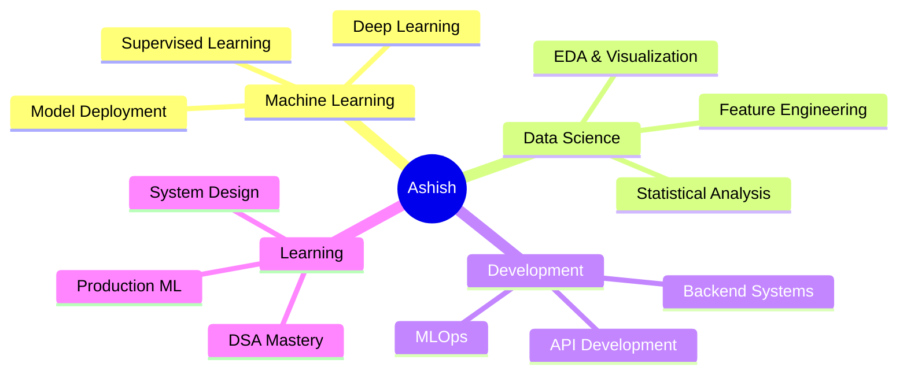

# 👋 Hi there, I'm Ashish Kumar Singh

  

---

### 🚀 About Me

- 🎓 **B.Tech** in Computer Science & Engineering
- 📍 Based in **India**
- 💡 Passionate about **Data Science, Machine Learning & AI**
- 🔭 Building **practical, end-to-end ML projects**
- 🌱 Currently mastering **DSA, ML & Production Systems**
- 💬 Ask me about **Python, ML, Data Analysis**
- ⚡ Fun fact: I turn coffee into code ☕➡️💻

 

---

## 🛠️ Tech Stack & Tools

### 💻 Programming Languages

### 🤖 Data Science & Machine Learning

### 🧠 Deep Learning & AI

### 🌐 Backend & Deployment

### 🛠️ Tools & Technologies

---

## 📊 GitHub Stats

  

  

---

---

## 🎯 Current Focus

### 📈 What I'm Working On

- 🧠 **Strengthening DSA & Algorithmic Problem Solving**
- 🤖 **Building Production-Ready ML Systems**
- 🚀 **Deploying AI-Powered Applications**
- 📊 **Contributing to Open Source ML Projects**
- 🎓 **Learning Advanced Deep Learning Architectures**

---

## 🌟 Featured Projects

### 🚀 More Projects Coming Soon...

---

## 💼 Open To

| 🎯 Opportunities | 🤝 Collaboration | 🌱 Learning |
|:---:|:---:|:---:|
| Internships | AI/ML Projects | Advanced ML Techniques |
| Entry-Level Roles | Data Science | MLOps & Production |
| Freelance Work | Open Source | System Design |

---

## 📫 Let's Connect!

---

## 💭 Quote of the Day

---

<!-- Proudly created with ❤️ -->
